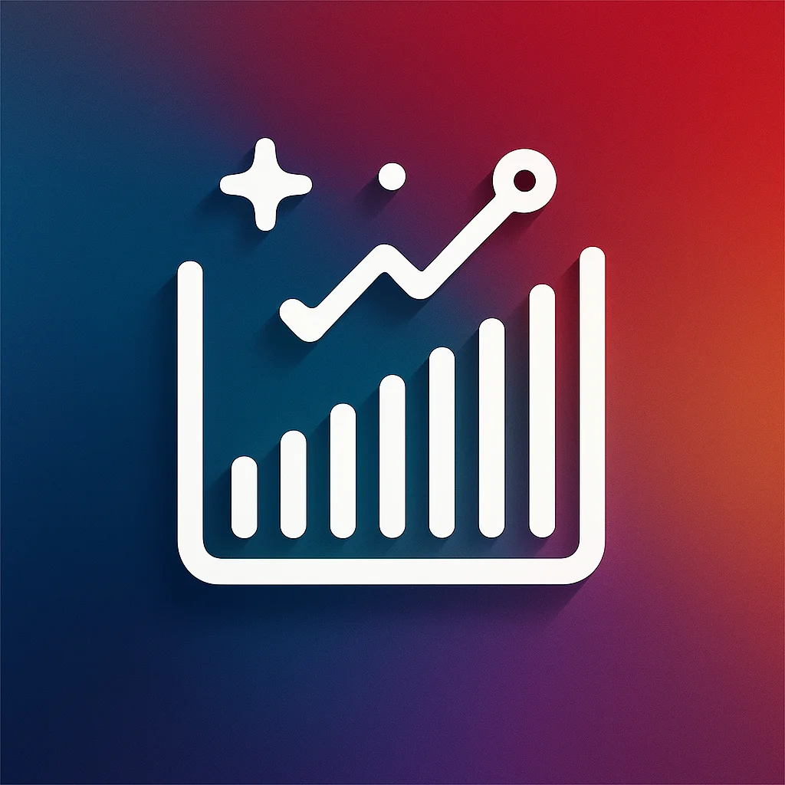

<p align="center">
  
  <h1 align="center">jQuery Charts</h1>
</p>
<p align="center">
  <a href="https://angular.io/">
    
  </a>
  <a href="https://www.npmjs.com/package/@oneteme/jquery-apexcharts">
    
  </a>
  <a href="https://github.com/oneteme/jquery-charts/blob/main/LICENSE">
    
  </a>
</p>
<p align="center">
  <strong style="font-size: 1.2em;">A flexible, modern chart visualization library for Angular applications,<br>
  offering a wide range of chart types and customization options with a unified syntax<br>
  for multiple charts libraries</strong>
</p>
<br/>

---

<br/>

## ✨ Features

- 📊 Multiple chart types: Pie, Bar, Line, Treemap, Heatmap, Range, Funnel charts and more
- 🎨 Highly customizable with extensive configuration options
- 🔄 Interactive demos with source code preview for each chart type
- 🧩 Modular architecture for easy integration

<br/>

---

<br/>

## 📋 Table of Contents

- [Installation](#-installation)
- [Development Setup](#-development-setup)
- [Project Structure](#-project-structure)
- [Available Chart Types](#-available-chart-types)
- [Documentation](#-documentation)
- [Contributing](#-contributing)
- [License](#-license)

<br/>

---

<br/>

## 🚀 Installation

Using npm:

```bash
npm install @oneteme/jquery-core @oneteme/jquery-apexcharts
```

<br/>

---

<br/>

## 🛠️ Development Setup

1. Clone the repository:

```bash
git clone https://github.com/oneteme/jquery-charts.git
cd jquery-charts
```

2. Install dependencies:

```bash
npm install
```

3. Start the development server:

```bash
npm run dev
```

This will concurrently:

- Build the `jquery-core` library in watch mode
- Build the `jquery-apexcharts` library in watch mode (after core library is built)
- Start the Angular application in development mode

4. If you just want to work on the demo, you can simply enter this command :

```bash
npm run start
```

<br/>

---

<br/>

## 📁 Project Structure

```
jquery-charts/
├── projects/
│   └── oneteme/
│       ├── jquery-core/        # Core library with chart models and utilities
│       └── jquery-apexcharts/  # ApexCharts integration components
│
└── src/                        # Main application demo
    ├── app/
    │   ├── core/               # Core services
    │   ├── data/               # Sample chart data
    │   ├── pages/              # Application pages
    │   └── components/         # Shared components
    └── assets/                 # Static assets
```

<br/>

---

<br/>

## 📊 Available Chart Types

- **Pie Charts**: Standard pie, donut, polar area, and radial charts
- **Bar Charts**: Vertical, horizontal, stacked, and grouped bar charts
- **Line Charts**: Basic, curved, stepped, and annotated line charts
- **Treemap Charts**: Hierarchical visualization of data
- **Heatmap Charts**: Color-coded data visualization
- **Range Charts**: Range area, range bar charts
- **Funnel Charts**: Visualization for sequential data

<br/>

---

<br/>

## 📖 Documentation

The project includes comprehensive documentation with:

- Configuration options for each chart type
- Usage examples with code snippets
- Best practices and customization tips

Visit the documentation section in the application to learn more about using jQuery Charts.

<br/>

---

<br/>

## 👥 Contributing

Contributions are welcome! Please feel free to submit a Pull Request.

1. Fork the repository
2. Create your feature branch (`git checkout -b feature/amazing-feature`)
3. Commit your changes (`git commit -m 'Add some amazing feature'`)
4. Push to the branch (`git push origin feature/amazing-feature`)
5. Open a Pull Request

<br/>

---

<br/>

## 📄 License

This project is licensed under the Apache 2.0 License - see the [LICENSE](LICENSE) file for details.
<br/><br/><br/>

---

<br/>

### ⚠️ Third-Party Licenses

**IMPORTANT LEGAL NOTICE**: This section contains critical licensing information that may have legal implications for users. By using this library, you agree to comply with all applicable third-party licenses.

The library integrates with the following charting libraries. Please be aware of their respective licensing terms:

- [ApexCharts](https://github.com/apexcharts/apexcharts.js/blob/master/LICENSE) - MIT License
- [Highcharts](https://www.highcharts.com/license) - Commercial License (requires purchase for commercial use)

