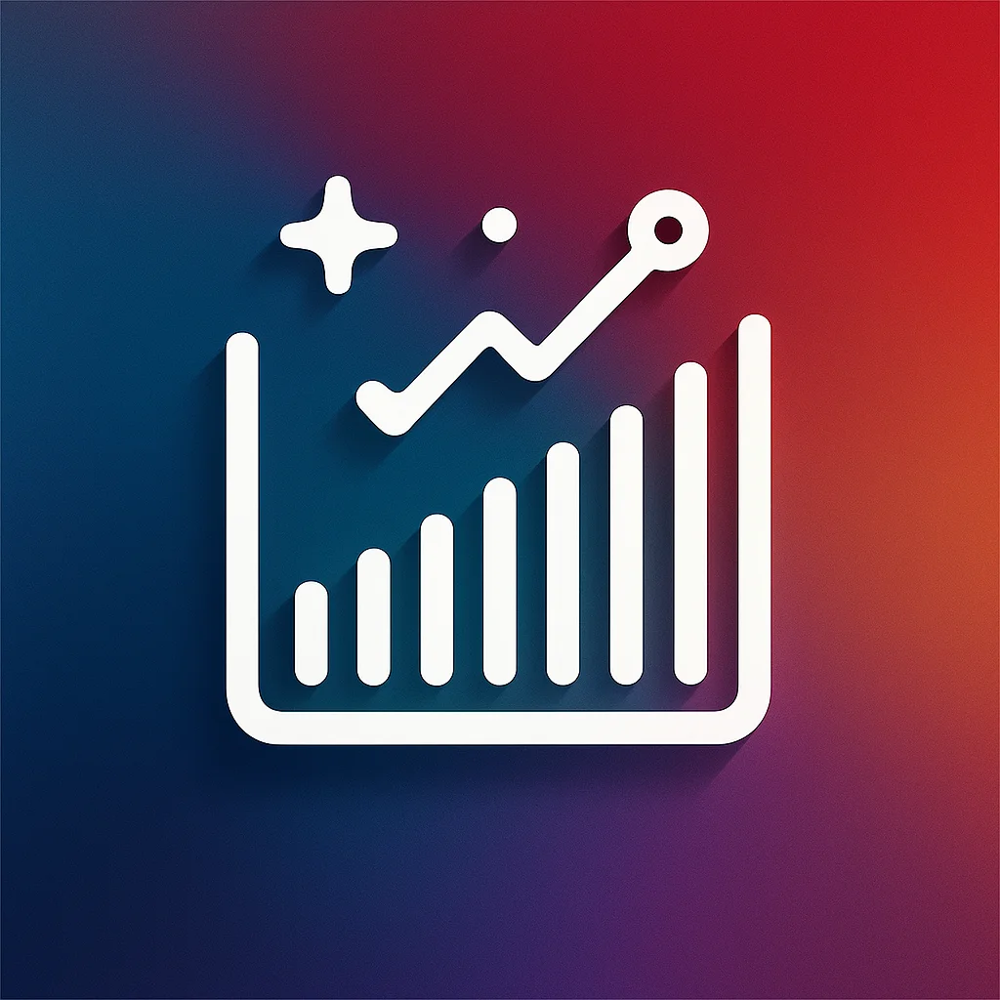

<p align="center">
  
  <h1 align="center">jQuery Charts</h1>
</p>
<p align="center">
  <a href="https://angular.io/">
    
  </a>
  <a href="https://www.npmjs.com/package/@oneteme/jquery-core">
    
  </a>
  <a href="https://github.com/oneteme/jquery-charts/blob/main/LICENSE">
    
  </a>
</p>
<p align="center">
  A modular chart and table library for Angular, providing a unified configuration API across multiple rendering engines.
</p>

---

## Table of Contents

- [Packages](#packages)
- [Installation](#installation)
- [Development Setup](#development-setup)
- [Project Structure](#project-structure)
- [Chart Types](#chart-types)
- [Contributing](#contributing)
- [License](#license)

---

## Packages

| Package | Description | Version |
|---------|-------------|---------|
| [`@oneteme/jquery-core`](https://www.npmjs.com/package/@oneteme/jquery-core) | Shared data model and utilities | [](https://www.npmjs.com/package/@oneteme/jquery-core) |
| [`@oneteme/jquery-apexcharts`](https://www.npmjs.com/package/@oneteme/jquery-apexcharts) | Renderer -- [ApexCharts](https://apexcharts.com/) | [](https://www.npmjs.com/package/@oneteme/jquery-apexcharts) |
| [`@oneteme/jquery-highcharts`](https://www.npmjs.com/package/@oneteme/jquery-highcharts) | Renderer -- [Highcharts](https://www.highcharts.com/) *(commercial license)* | [](https://www.npmjs.com/package/@oneteme/jquery-highcharts) |
| [`@oneteme/jquery-echarts`](https://www.npmjs.com/package/@oneteme/jquery-echarts) | Renderer -- [Apache ECharts](https://echarts.apache.org/) *(beta)* | [](https://www.npmjs.com/package/@oneteme/jquery-echarts) |
| [`@oneteme/jquery-table`](https://www.npmjs.com/package/@oneteme/jquery-table) | Declarative table built on Angular Material | [](https://www.npmjs.com/package/@oneteme/jquery-table) |

All renderers share the same `@oneteme/jquery-core` configuration API. Switching from one renderer to another requires only changing the imported package.

---

## Installation

Install `@oneteme/jquery-core` and one renderer:

```bash
# ApexCharts (open source)
npm install @oneteme/jquery-core @oneteme/jquery-apexcharts

# Apache ECharts (open source, beta)
npm install @oneteme/jquery-core @oneteme/jquery-echarts@beta

# Highcharts (commercial license required)
npm install @oneteme/jquery-core @oneteme/jquery-highcharts highcharts

# Table component
npm install @oneteme/jquery-core @oneteme/jquery-table
```

---

## Development Setup

```bash
git clone https://github.com/oneteme/jquery-charts.git
cd jquery-charts
npm install
```

Start the demo application:

```bash
npm run start
```

Build a specific library:

```bash
npm run b1   # jquery-core
npm run b2   # jquery-apexcharts
npm run b3   # jquery-highcharts
npm run b4   # jquery-echarts
npm run b5   # jquery-table
```

Build all libraries and start the application in watch mode:

```bash
npm run dev
```

---

## Project Structure

```
jquery-charts/
+-- projects/
|   +-- oneteme/
|       +-- jquery-core/         # Shared data model and utilities
|       +-- jquery-apexcharts/   # ApexCharts renderer
|       +-- jquery-highcharts/   # Highcharts renderer
|       +-- jquery-echarts/      # Apache ECharts renderer (beta)
|       +-- jquery-table/        # Angular Material table component
|
+-- src/                         # Demo application
    +-- app/
    |   +-- core/                # Services
    |   +-- data/                # Sample data
    |   +-- pages/               # Demo pages
    |   +-- components/          # Shared components
    +-- assets/
```

---

## Chart Types

| Type | Description |
|------|-------------|
| `bar` | Vertical and horizontal bar charts, stacked, grouped |
| `columnpyramid` | Bar chart with pyramid columns |
| `line` | Line and step charts |
| `area` | Filled area charts |
| `pie` / `donut` | Pie and donut charts |
| `scatter` | Point distribution charts |
| `heatmap` | Color-coded matrix charts |
| `radar` | Multi-variable comparison charts |
| `treemap` | Hierarchical data visualization |
| `funnel` | Sequential flow visualization |
| `range` | Range area and range bar charts |

> Not all types are supported by every renderer. Refer to each package README for details.

---

## Contributing

1. Fork the repository
2. Create a feature branch: `git checkout -b feature/my-feature`
3. Commit your changes following [Conventional Commits](https://www.conventionalcommits.org/)
4. Push and open a Pull Request

---

## License

This project is licensed under the [Apache 2.0 License](LICENSE).

### Third-Party Licenses

- [ApexCharts](https://github.com/apexcharts/apexcharts.js/blob/master/LICENSE) -- MIT License
- [Apache ECharts](https://github.com/apache/echarts/blob/master/LICENSE) -- Apache 2.0 License
- [Highcharts](https://www.highcharts.com/license) -- Commercial license required for commercial use
